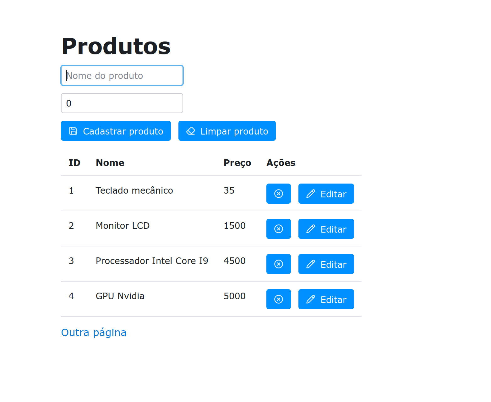

# App demo

- **Clonar o repositório.**
- **Instalar as dependências.** `poetry install` ou `pip install -r requirements.txt`
- **Variáveis de ambiente**. Criar um arquivo `.env` na raiz do projeto. Exemplos no arquivo `env`.
- **Criar o database definido no arquivo .env**. Projeto usa `postgresql`.
- **Executar migrações.** `reflex db migrate`
- **Executar o projeto.** `reflex run`

